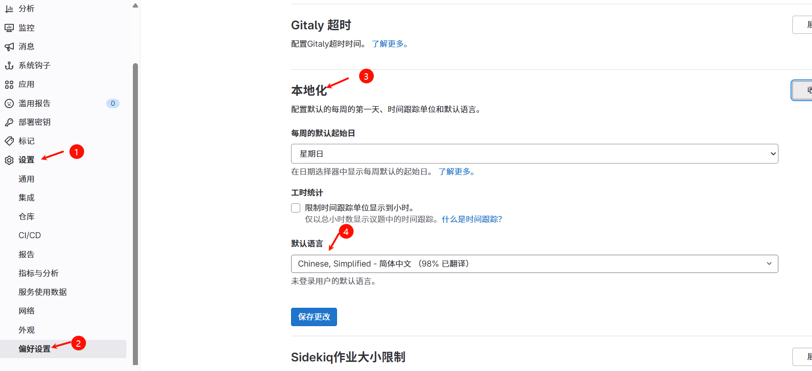
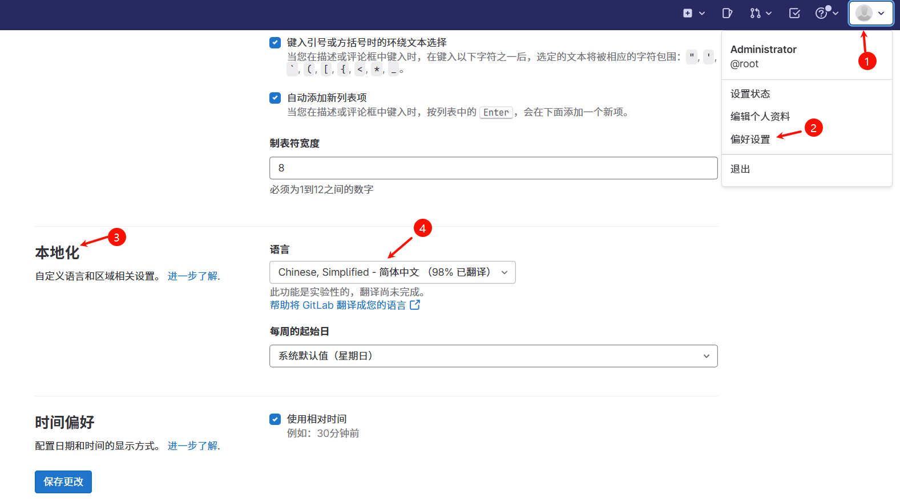
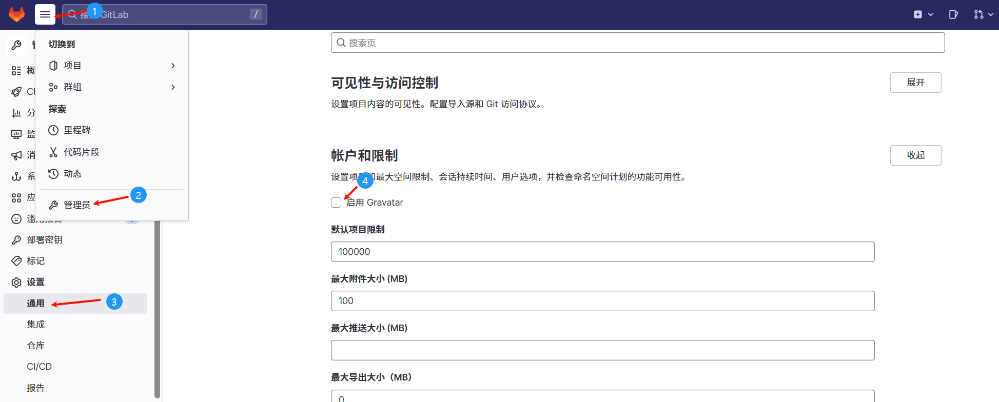
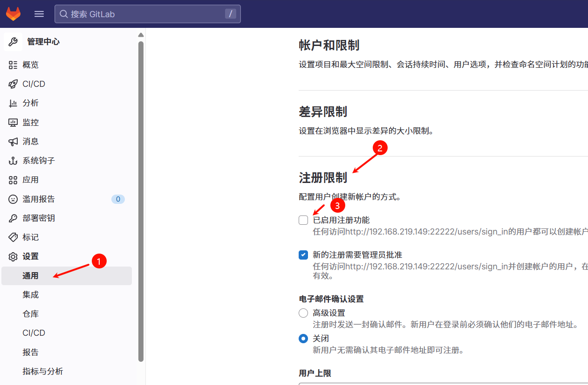
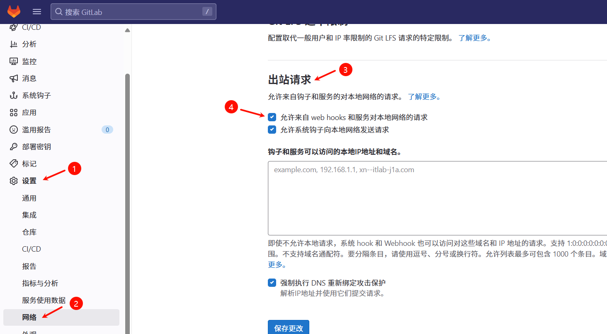

动态构建PV，PVC创建→(当前)gitlab安装→git关联到gitlab并推送项目→harbor安装→sonarqube安装→jenkins安装→连接各个中间件形成Devops→创建流水线任务

这里我选择在node2上安装（不是安装在k8s集群里,只是懒得再创建一个虚拟机）

安装之前请保证虚拟机有足够的内存空间 ，gitlab 运行要占用大约2.5GB


## 下载安装包
`wget https://mirrors.tuna.tsinghua.edu.cn/gitlab-ce/yum/el7/gitlab-ce-15.9.1-ce.0.el7.x86_64.rpm`

## 安装
`rpm -i gitlab-ce-15.9.1-ce.0.el7.x86_64.rpm`

## 编辑 /etc/gitlab/gitlab.rb 文件
修改 external_url 访问路径 http://<宿主机ip>:<port>,我这里为`http://192.168.219.149:22222` 这就是访问gitlab Webui的地址 


## 其他配置修改如下
```
gitlab_rails['time_zone'] = 'Asia/Shanghai'
puma['worker_processes'] = 2
sidekiq['max_concurrency'] = 8
postgresql['shared_buffers'] = "128MB"
postgresql['max_worker_processes'] = 4
prometheus_monitoring['enable'] = false

```

## 更新配置并重启::
`gitlab-ctl reconfigure`
`gitlab-ctl restart`

完成配置之后会生成初始默认账户
`Username:root`

Password存储在`/etc/gitlab/initial_root_password` 
查看密码`cat /etc/gitlab/initial_root_password `  
首次登录后务必修改密码，该文件会在 GitLab 首次重新配置（gitlab-ctl reconfigure）后 24 小时内自动删除  

这里我改为:`!zorin987`

-----------
# WebUI设置：
 ## 设置语言为中文（全局）
 Settings > Preferences > Localization > Default language > 选择简体中文 > Save changes


## 设置当前用户语言为中文
 右上角用户头像 > Preferences > Localization > Language > 选择简体中文 > Save changes
 

## 登录后修改默认密码 
右上角头像 > Perferences > 左侧栏Password

## 修改系统配置：点击左上角三横 > Admin
 Settings > General > Account and limit > 取消 Gravatar enabled > Save changes
 

 ## 关闭用户注册功能
 Settings > General > Sign-up restrictions > 取消 Sign-up enabled > Save changes
 

 ## 开启 webhook 外部访问
 Settings > Network > Outbound requests > Allow requests to the local network from web hooks and services 勾选
 
