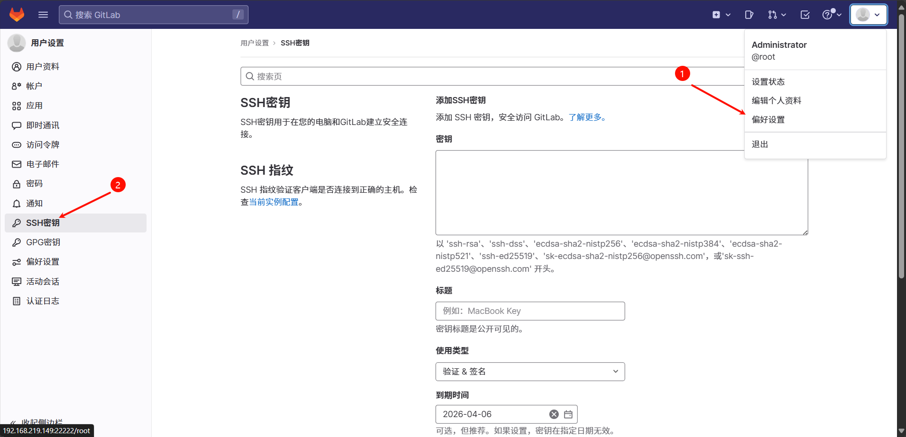
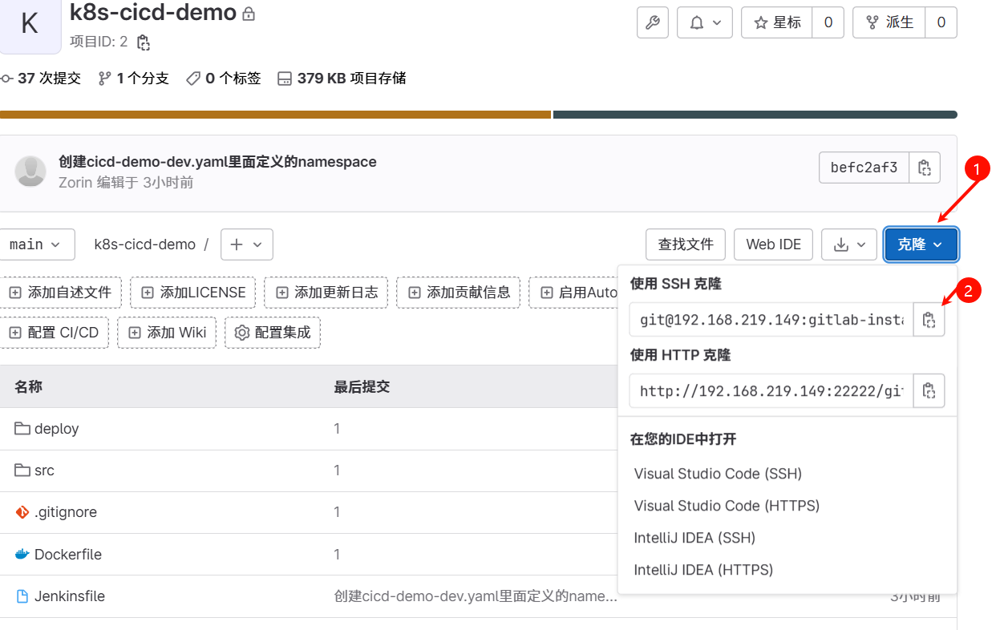

| 步骤 | 描述                                   |
|------|----------------------------------------|
| 1    | [动态构建 PV 和 PVC](1.创建动态构建PV，PVC/动态构建Pv,pvc.md)                     |
| 2    | [安装 GitLab](2.gitlab安装/gitlab安装.md)                            |
| 3    |➡️ [将 Git 关联到 GitLab 并推送项目](3.使用git推送项目到gitlab/使用git推送项目到gitlab.md)        |
| 4    | [安装 Harbor](4.Harbor安装/Harbor安装.md)                           |
| 5    | [安装 SonarQube](5.Sonarqube安装/Sonarqube安装.md)                         |
| 6    | [安装 Jenkins](6.jenlinks安装/jenlinks安装.md)                           |
| 7    | [连接各个中间件形成 DevOps](7.连接各个中间件形成devops/连接中间件形成Devops.md)         |
| 8    | [创建流水线任务](8.创建pipe流水线/创建流水线任务.md)    

[git的安装和使用](https://github.com/Zorinman/git-github/tree/main/git%E4%B8%8Egithub)

## 打开k8s-cicd-demo项目文件夹，删除之前的.git目录 创建自己的git本地仓库并关联到远程gitlab仓库

1.[配置name和email，git init初始化，生成密钥,](https://github.com/Zorinman/git-github/blob/main/git%E4%B8%8Egithub/git%E7%9A%84%E4%BD%BF%E7%94%A8.md)

**把git生成的pub公钥添加到gitlab**

**2.在git bash 中将git于gitlab上的仓库关联** 
`git remote add origin git@192.168.219.149:gitlab-instance-0cafae89/k8s-cicd-demo.git`   

origin为gitlab上需要关联仓库的名字 可自行修改（如我的为K8S）
后面内容复制与gitlab的SSH克隆（HTTP克隆也可以）

**3.修改本地仓库分支为main与gitlab仓库上一致**
`git branch -m master main`

第一次通常先将远程仓库拉取到本地进行合并（无论远程仓库是不是空的） 否则有可能报错（如果远程仓库有提交记录而本地没有的话）

**4.完成拉取和推送**
将gitlab某个仓库拉取至本地 `git pull  远程仓库名称 远程分支名`

将本地仓库内容推送至gitlab的某个仓库 `git push  远程仓库名称 远程分支名`

1.gitlab上创建一个k8s-cicd-demo的空仓库
2.先追踪所有目录文件添加到暂缓区`git add .`
3.确认无误提交到本地仓库 `git commit -m "本次提交的注释"`
4.先拉取一下gitlab仓库防止信息不一致`git pull k8s-cicd-demo main`
5.提交本地仓库的内容到gitlab（即把整个项目推上去）`git push k8s-cicd-demo main`

推送出现冲突则可能是本地仓库和远程仓库的内容不一致 需要先将远程仓库的拉取下来
使用 --allow-unrelated-histories 选项进行拉取： 在执行拉取操作时，添加 --allow-unrelated-histories 选项，以允许合并不相关的历史：
git pull git-github main --allow-unrelated-histories  这将允许 Git 合并本地和远程仓库的历史，即使它们没有共同的祖先。

