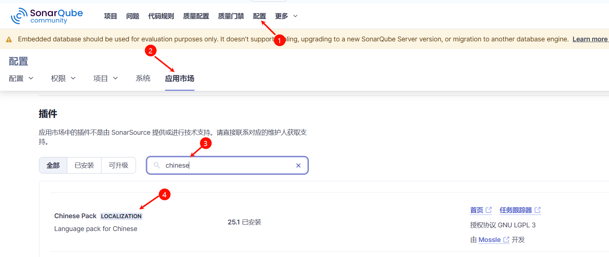

动态构建PV，PVC创建→gitlab安装→git关联到gitlab并推送项目→harbor安装→(当前)sonarqube安装→jenkins安装→连接各个中间件形成Devops→创建流水线任务

**这里把pgsql.yaml文件和sonarqube.yaml放在master节点的/opt/k8s/devops/sonarqube进行安装**

⭐创建一个名为`kube-devops`的命名空间，之后Sonarqube,jenkins,pgsql都会部署在这个命名空间里

部署yaml资源安装 `kubeclt apply -f .`

注意这里使用持久化存储，匹配使用动态构建pv,pvc的模式的storageclass  需要提前配置好Provisioner StorageClass RBAC  ,我们已经配置好

**查看对应命名空间下的Sonarqube服务**
复制映射的外部端口  因为是Nodeport形式，所以使用任意集群IP+端口号就可访问

账号密码在 默认都为admin
这里我把密码改为!Zhoulinguang987

## 安装中文插件

