| 步骤 | 描述                                   |
|------|----------------------------------------|
| 1    | [动态构建 PV 和 PVC](../1.创建动态构建PV，PVC/动态构建Pv,pvc.md)                     |
| 2    | [安装 GitLab](../2.gitlab安装/gitlab安装.md)                            |
| 3    | [将 Git 关联到 GitLab 并推送项目](../3.使用git推送项目到gitlab/使用git推送项目到gitlab.md)        |
| 4    | [安装 Harbor](../4.Harbor安装/Harbor安装.md)                           |
| 5    | [安装 SonarQube](../5.Sonarqube安装/Sonarqube安装.md)                         |
| 6    | [安装 Jenkins](../6.jenlinks安装/jenlinks安装.md)                           |
| 7    | ➡️[连接各个中间件形成 DevOps](../7.连接各个中间件形成devops/连接中间件形成Devops.md)         |
| 8    | [创建流水线任务](../8.创建pipe流水线/创建流水线任务.md)                          |


## 一、配置中间件的secret和token
为了jenkins的构建任务能够登录各个中间件需要配置secret和token
### 1.gitlab的sercert
 **创建 gitlab 默认用户名密码 secret文件**

```command
echo root > ./username
echo `!zorin987`> password
```
**生成两个文件**：
username - 包含 Git 用户名

password - 包含 Git 密码


**利用这两个文件在 kube-devops 命名空间中创建一个名为 git-user-pass 的 通用型 Secret，**

`kubectl create secret generic git-user-pass --from-file=./username --from-file=./password -n kube-devops`

### 2.harbor的sercert

kube-devops 命名空间中创建一个 docker-registry 类型的 Secret，用于存储访问 Harbor 镜像仓库   
其中username=admin ，password=Harbor12345

`kubectl create secret docker-registry harbor-secret --docker-server=192.168.219.129:80 --docker-username=admin --docker-password=Harbor12345 -n kube-devops`

### 3.sonarqube的token
登录到 sonarqube 后台，点击头像 > MyAccount > Security > Generate Tokens > generate 生成 token 并复制

⭐ 一定先记住这个token 不然会消失
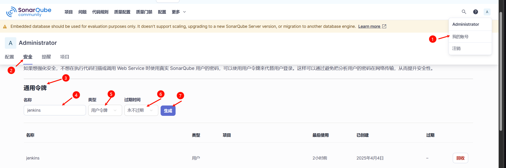


## 二、配置Jenkins中间件的所有全局凭证
这些凭证使得Jenkins构建流水线任务时可以与中间件访问交互
**Dashboard > 系统管理 >凭证管理**
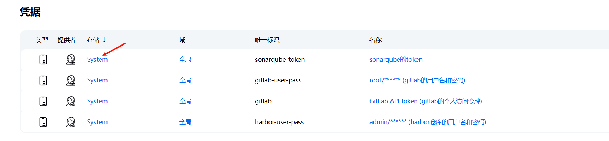
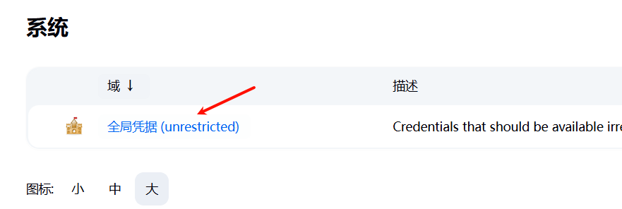
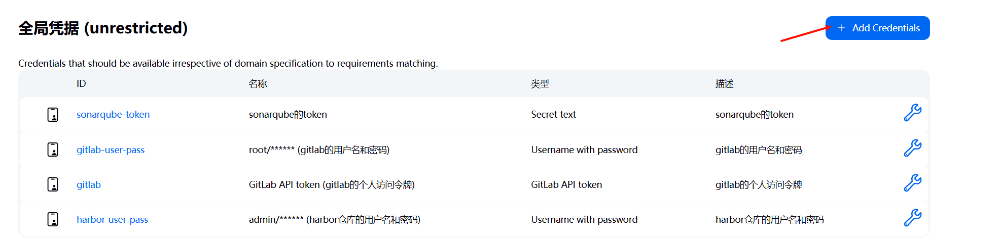

**1.sonarqube的凭证:**
类型为Secret text
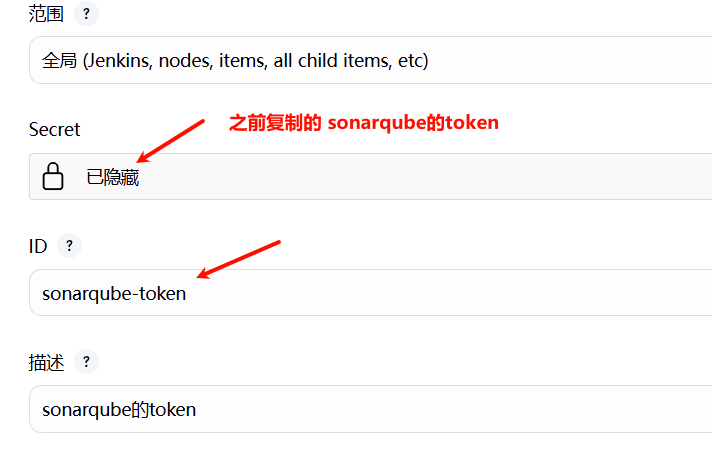

**2.gitlab的凭证**
类型为Username with password
你gitlab的用户名和密码
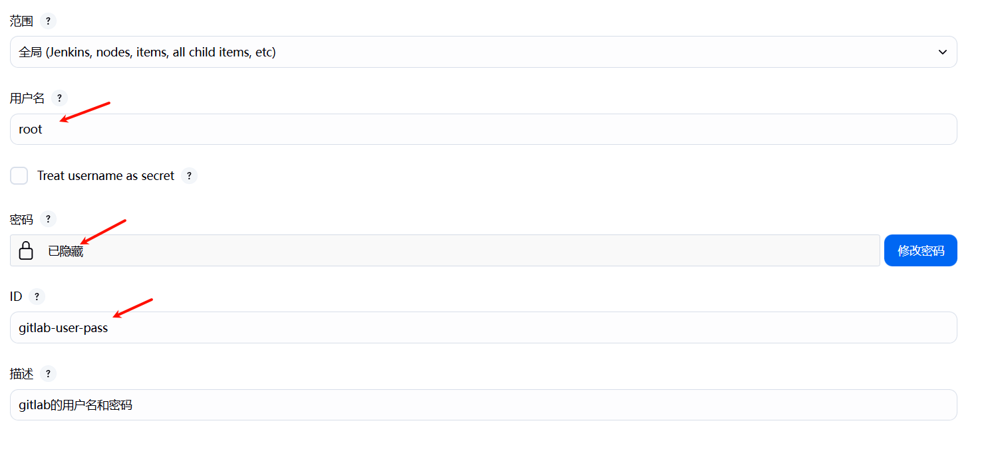

**3.harbor的凭证**
类型为Username with password
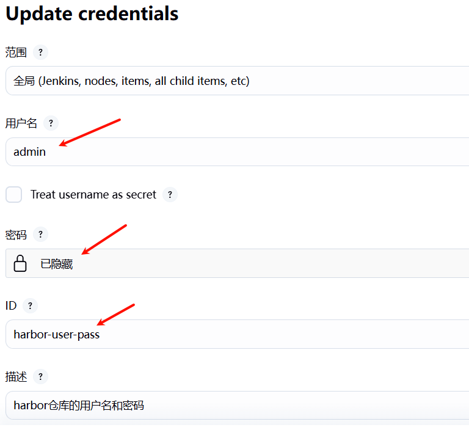

**4.gitlab的aip token将在之后构建pipeline任务时为gitlab创建**


## 三,配置sonarqube和gitlab的webhook
webhook钩子函数用于Jenkins构建任务时sonarqube和gitlab触发钩子函数将信息结果通知给Jenkins

**1.sonarqube的Webhook**
名称和URL设置如图，其中URL为Jenkins的地址+ /sonarqube-webhook/
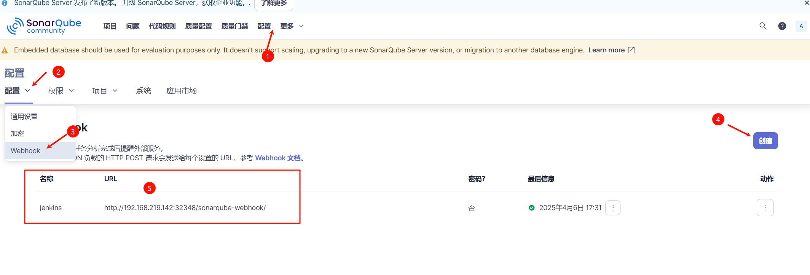

**2.gitlab的Webhook在创建pipeline流水线时配置**


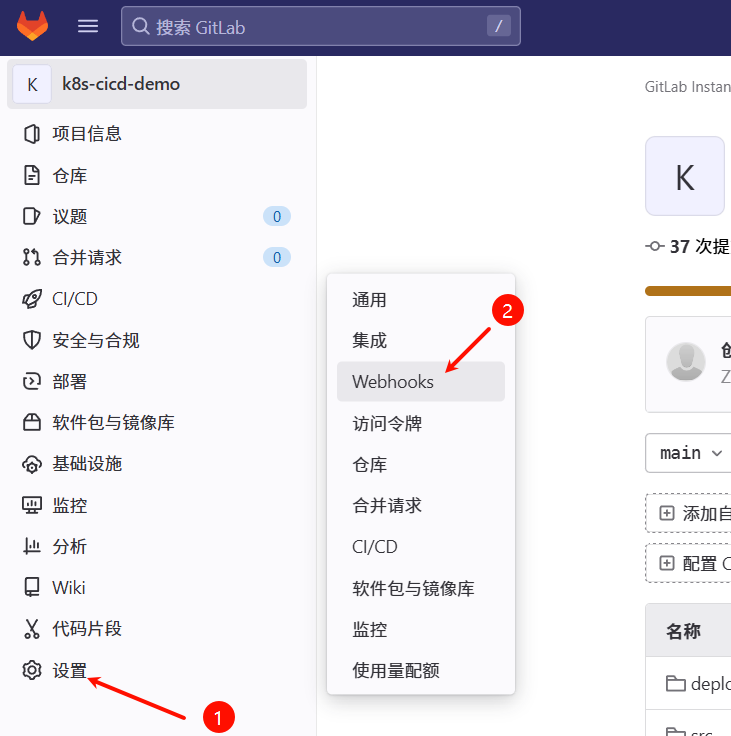
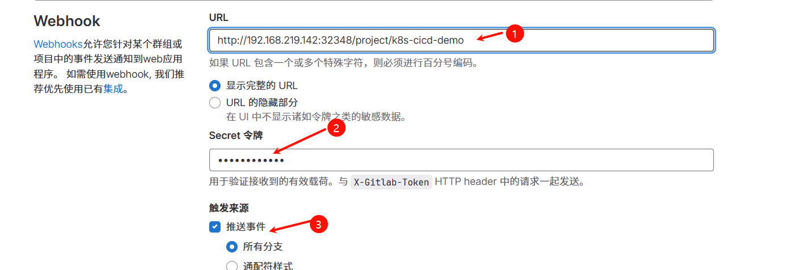


## 四、配置Jenkins的插件
**1.配置 SonarQube servers： Dashboard > 系统管理 > Configure System**
Name：sonarqube   # 注意这个名字要在 Jenkinsfile 中用到

Server URL：`http://sonarqube:9000`（因为jenkins和sonarqube在同一命名空间下，所有可以直接使用服务名和内部端口号）

**这里将之前创建好的sonarqube的凭证添加进去**

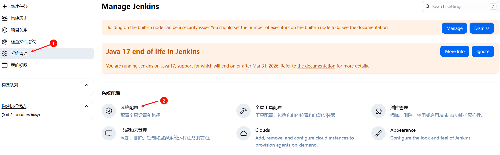
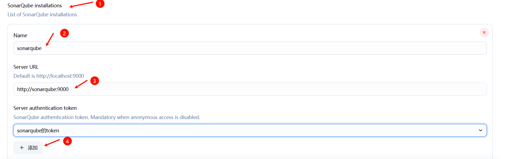


**2.进入 Dashboard > 系统管理 > 节点管理 > Configure Clouds 页面配置 k8s 集群**
我们这里jenkins是部署在k8s集群内部的容器上
```
名称：kubernetes
#点击 Kubernetes Cloud details 继续配置
Kubernetes 地址：
	如果 jenkins 是运行在 k8s 容器中，直接配置服务名即可
		https://kubernetes.default
	如果 jenkins 部署在外部，那么则不仅要配置外部访问 ip 以及 apiserver 的端口（6443），还需要配置服务证书

Jenkins 地址：
	如果部署在 k8s 集群内部：http://jenkins-servic
e.kube-devops 或者http://jenkins-servic:8080

Jenkins的agent通道默认为50000端口：jenkins-service:50000

	
    如果在外部：http://192.168.219.142:32348（换成你们自己的jenkins）
```
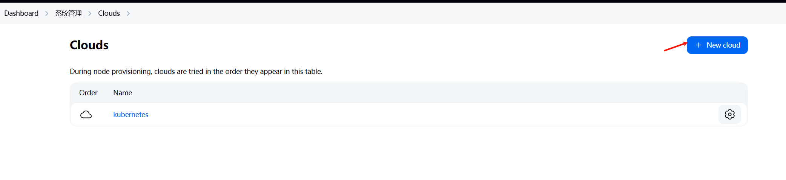

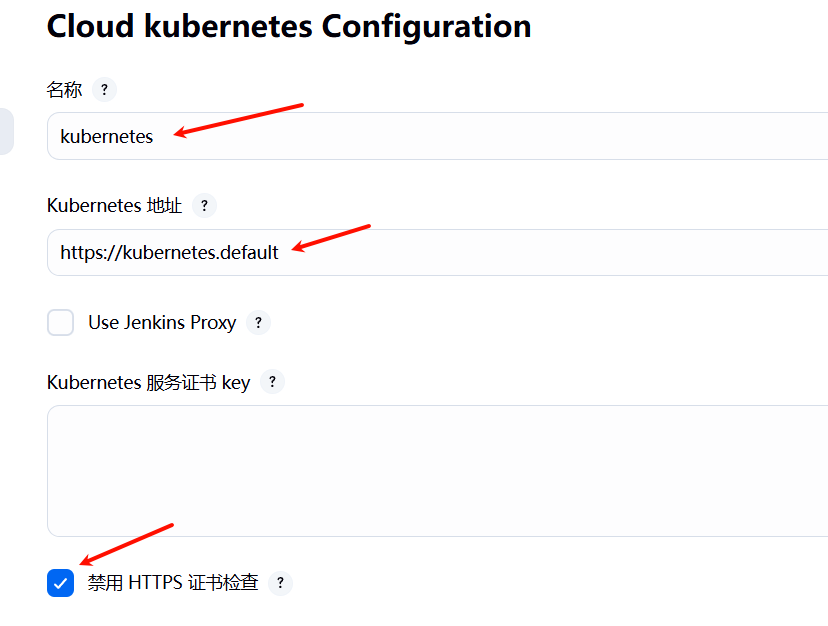
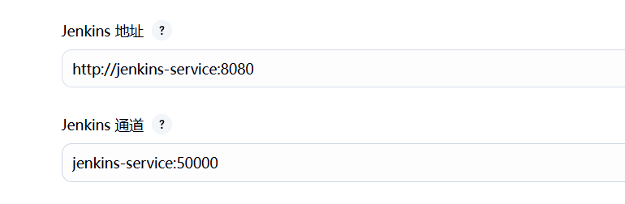

在节点列表的master节点中添加一个maven标签（后面好像没啥用）

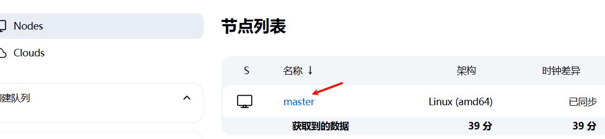
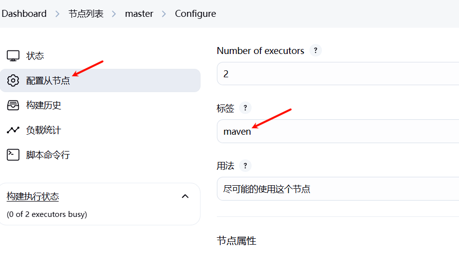

**3.将k8s中kubeconfig配置文件加载到jenkins**

在k8s中查看kubeconfig配置文件的位置
`echo $KUBECONFIG`
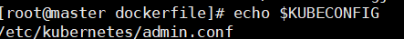
查看文件内容 
`cat /etc/kubernetes/admin.conf`
复制文件内所有内容

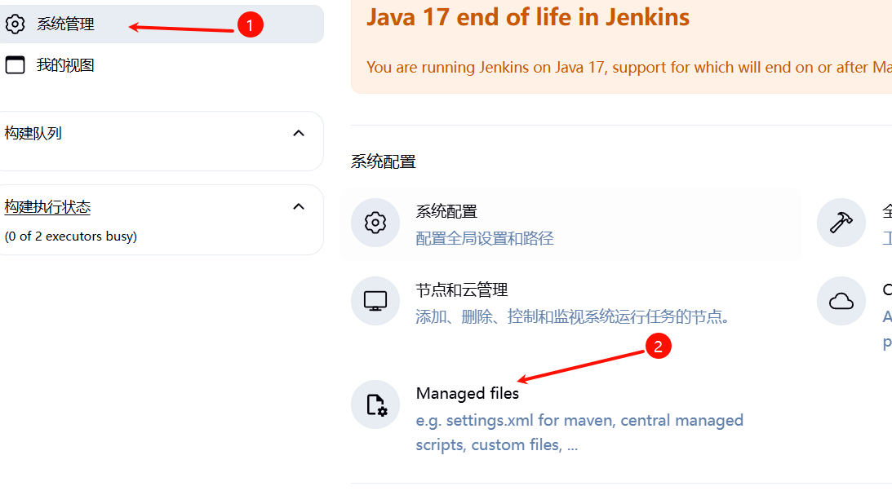

Add new Config

其中ID为自动生成
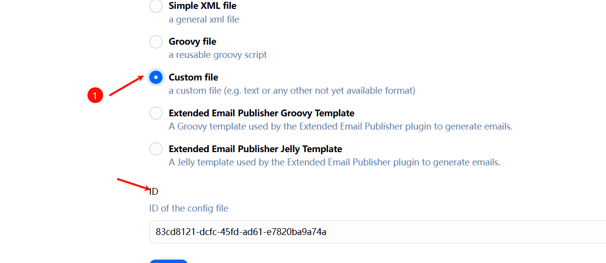

将之前复制的内容全部粘贴到content中
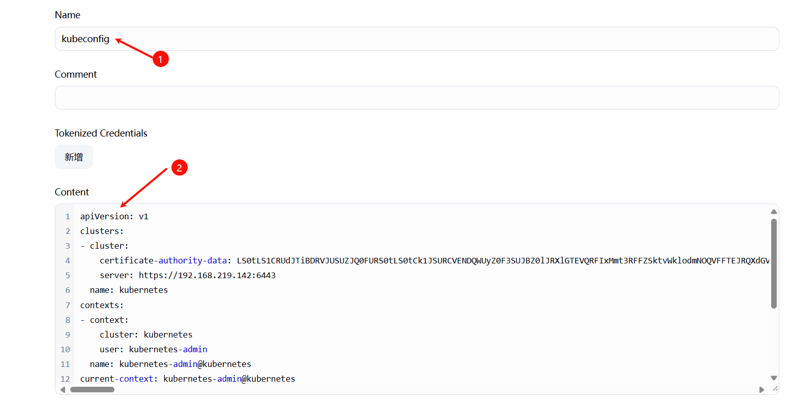