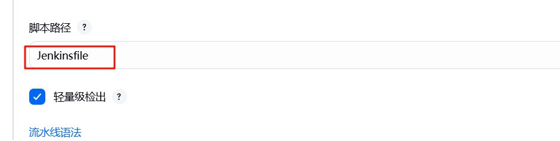
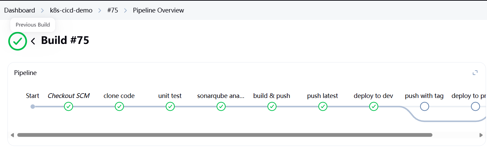
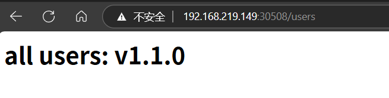

| 步骤 | 描述                                   |
|------|----------------------------------------|
| 1    | [动态构建 PV 和 PVC](1.创建动态构建PV，PVC/动态构建Pv,pvc.md)                     |
| 2    | [安装 GitLab](2.gitlab安装/gitlab安装.md)                            |
| 3    | [将 Git 关联到 GitLab 并推送项目](3.使用git推送项目到gitlab/使用git推送项目到gitlab.md)        |
| 4    | [安装 Harbor](4.Harbor安装/Harbor安装.md)                           |
| 5    | [安装 SonarQube](5.Sonarqube安装/Sonarqube安装.md)                         |
| 6    | [安装 Jenkins](6.jenlinks安装/jenlinks安装.md)                           |
| 7    | [连接各个中间件形成 DevOps](7.连接各个中间件形成devops/连接中间件形成Devops.md)         |
| 8    | ➡️[创建流水线任务](8.创建pipe流水线/创建流水线任务.md)                       |

这里使用gitlab上的项目来构建流水线任务
## 1.在jenkins上创建一个流水线类型的任务

记住这里的Gitlab webhook URL

点击高级，在下面生成gitlab的secret Token（这就是全局凭证中Gitlab apitoken）

**点一下应用,这时候去配置Gitlab的Webhook**

**继续回来配置流水线任务**
这里选择从Gillab项目中获取Pipeline的Jenkinsfile脚本文件
这样会从Git仓库中的项目里读取 Jenkinsfile文件，构建任务就是按照该文件内的内容来进行构建的
Repository URL：在Giblab项目仓库中选择复制HTTP克隆的地址
Credentials为之前创建的Gitlab凭证

确认分支与gitlab仓库一致

脚本路径为Jenkinsfile，表示使用的就是Gitlab最上级目录的Jenkinsfile文件

## 2.开始构建任务

**可以查看构建的信息 **

这样就会从Jenkins的master容器里直接进行任务构建

jenkins master pod 里已经挂载了docker kubectl，kubeconfig，maven环境，sonarqube的命令工具等等，这使得jenkinsfile中那些step的命令如mvn,kubectl,docker,sonarqube都可以使用（在jenkins容器中）

从gitlab拉取项目 然后Sonarqube进行代码审查，打包成镜像推送到harbor仓库，将gitlab上的项目以pod形式部署在k8s上

** 查看部署在k8s上的项目**

打开浏览器访问 `http://192.168.219.142:30508/user`即可访问到该项目的API入口

gitlab上的项目是一个最基本的 Spring Boot 应用，并且通过一个简单的 REST API 路径 /users 返回一个响应。
这个项目只有两个文件：

`K8sCicdDemoApplication`（应用启动类）：这个类是 Spring Boot 应用的入口点，它包含了 main 方法，Spring Boot 会通过 SpringApplication.run() 启动应用

`UserController`（控制器类）：这个类定义了一个简单的 RESTful API，提供了一个 /users 路径，用户可以通过 GET 请求来访问这个接口。

适合 Spring Boot 初学者来理解和体验以下概念：

Spring Boot 应用结构：如何创建和启动一个 Spring Boot 应用。

RESTful API：如何在 Spring Boot 中定义一个基本的 RESTful API，并处理 GET 请求。

日志记录：如何在 Spring Boot 中使用日志记录请求参数（如 age）。
