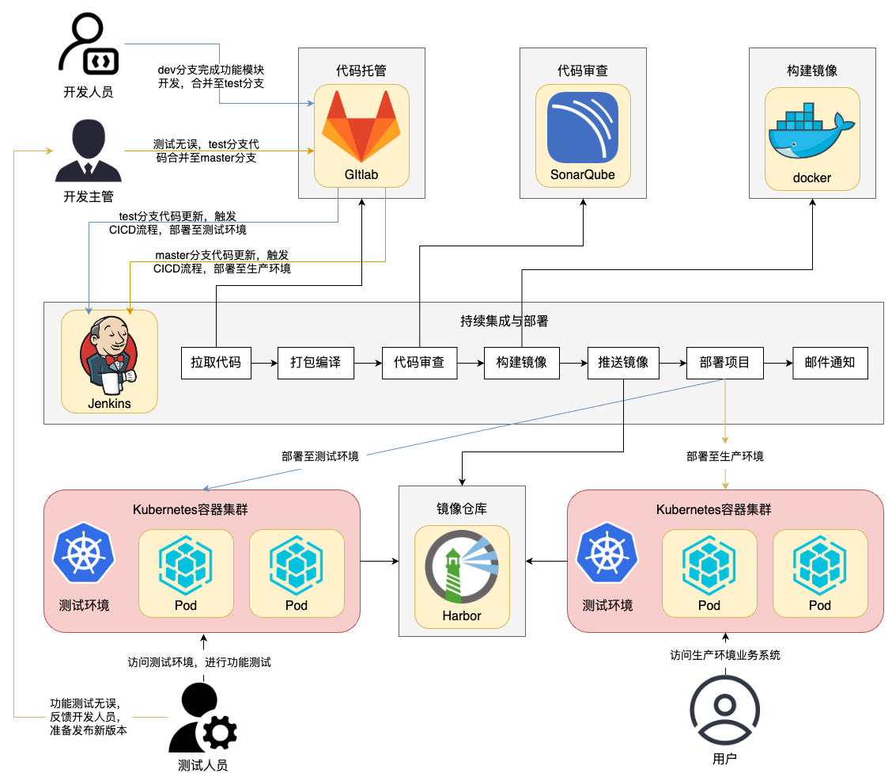

**本次CICD流程图如下：**



### k8s集群内:
`master：192.168.219.142`
`node1:192.168.219.148`
`node2:192.168.219.149`

**jenkins**:
username:`admin`
password:`123`
部署在k8s命名空间:`kube-devops` ,Web地址:`http://192.168.219.142:32348/`
**SonarQube**:
username:`admin`
password:`!Zhoulinguang987`
部署在k8s命名空间:`kube-devops`，Web地址:`http://192.168.219.142:31474/`

---------
### k8s集群外
**harbor**:
`192.168.219.129`
username:`admin `
password:`Harbor12345`
Web地址:`http://192.168.219.129:80/`


**gitlab**:
username:`root`
password:`!zorin987`
部署在 node2虚拟机上(不是k8s集群内):`192.168.219.149`，Web地址:`http://192.168.219.149:22222/`


## ⭐全流程:
**jenkins master**:就是上面部署安装的Jenkins pod，Web地址:`http://192.168.219.142:32348/`

**动态slave创建**：jenkins构建任务可以从通过动态slave创建，就是jenkins的从节点（这里节点指的是容器），这样可以方便管理，更好的资源分配，动态slave需要根据定义的pod的yaml模板，模板我们可以在Jenkins的WebUI上定义，也可以在Jenkinsfile里定义 `agent kubernetes`就表示Jenkins会在K8S集群上动态创建pod来作为流水线任务的构建区。 这里我们需要`Jenkins Inbound Agent` 镜像，它是一种用于连接 Jenkins 控制器(jenkins master)的代理,使用JNLP 协议来解决agent的网络连接,我们一般将容器起名为jnlp，除此之外 还要在这个镜像基础上集成一系列的配置，如sonarqube cli，docker，maven环境等等.
```
pipeline{
    agent {
        kubernetes{
            yaml '''
                apiVersion: "v1"
                kind: "Pod"
                metadata:
                  name: "devops"
                spec:
                  containers:
                  #   需要默认的jenkins/inbound-agent并集成一系列构建所需要的环境 
                  - name: "jnlp"
                  ....
                  .....
            '''
        }


```
**⭐静态构建**：这里我们直接通过`agent  any`，让Jenkins默认选择jenkins master pod作为流水线任务的构建工作区，因此我们之前部署jenkins时在jenkins镜像中集成了sonarqube-cli和maven

另外在jenkin-deployment.yaml中我们还挂载了一系列的资源,使得jenkins master容器内可以直接使用docker,mvn,kubectl,sonarqube等命令进行流水线任务中的编译代码，构建镜像，代码审查，yaml资源部署等。

一下是其部分内容：
 ```yaml
 serviceAccountName: jenkins-admin
      imagePullSecrets: 
        - name: harbor-secret # 这是我们在kube-devops命名空间下创建的 secret，用于下面拉取镜像时登录harbor仓库
      containers:
        - name: jenkins
          image: 192.168.219.129:80/library/jenkins-maven:v1 #使用的是之前自己构建的集成了sonarqube-cli和maven的Jenkins镜像
          .....
          ....
   volumeMounts:
            - name: jenkins-data
              mountPath: /var/jenkins_home
            - name: docker
              mountPath: /run/docker.sock
            - name: docker-home
              mountPath: /usr/bin/docker
            - name: mvn-setting
              mountPath: /usr/local/apache-maven-3.9.9/conf/settings.xml
              subPath: settings.xml
            - name: daemon
              mountPath: /etc/docker/daemon.json
              subPath: daemon.json
            - name: kubectl
              mountPath: /usr/bin/kubectl
      volumes:
        - name: kubectl
          hostPath:
            path: /usr/bin/kubectl  #将集群的kubectl挂载到容器内
        - name: jenkins-data
          persistentVolumeClaim:
              claimName: jenkins-pvc
        - name: docker
          hostPath:
            path: /run/docker.sock # 将主机的 docker 挂载到容器中
        - name: docker-home
          hostPath:
            path: /usr/bin/docker
        - name: mvn-setting    #将configmap定义的maven的配置信息挂载到容器中的maven环境下
          configMap:
            name: mvn-settings
            items:
            - key: settings.xml
              path: settings.xml
        - name: daemon   #将docker守护进程文件挂载到容器内，这里docker同样要为harbor仓库进行http配置，如果外部已经配置那就可以了
          hostPath: 
            path: /etc/docker/
 ```


**1.创建构建任务发起构建**

**2.选择构建任务的容器或者节点**:
Jenkins根据项目里的jenkinsfile文件内的`agent  any`自动选择在jenkins master节点（就是部署的Jenkins的pod容器内）构建流水线任务

**3.拉取远程仓库代码**:
构建任务通过jenkins上创建gitlab-user-pass凭证访问gitlab并的从gitlab仓库拉取项目

**4.下载maven依赖并通过maven命令编译测试项目代码**：
jenkins master容器maven根据gitlab项目中的`pom.xml`中的内容从中央仓库下载需要的依赖和插件

`jenkins-configmap.yaml`中的`settings.xml`挂载到jenkins容器内的Maven 的 `/usr/local/apache-maven-3.9.9/conf/settings.xml`

 `settings.xml`是maven的配置文件，里面定义依赖下载源：告诉 Maven 除了中央仓库外，还应从哪些仓库下载依赖。我这里的私人仓库没有依赖和相关插件，所以`jenkins-configmap.yaml`不配置，就默认从中央仓库下载maven的依赖。

下载依赖后执行`mvn clean test`对拉取到的项目中的源码和test源码进行编译测试

**5.Sonarqube代码审查**：
利用jenkins上创建的sonarqube-token凭证在访问Sonarqube，容器中maven通过`setting.xml`集成了sonaerqube，在容器内`通过maven sonaer命令`凭借sonarqube-token凭证访问sonaerqube
让Sonarqube对项目代码进行代码审查，审查完毕通过后Sonarqube触发webhook钩子函数通知jenkins代码审查通过，开始进行下一步构建

**6.根据项目的dockerfile文件将项目构建成镜像并将推送到harbor仓库**：
jenkins master容器通过jenkins上的harbor-user-pass凭证访问harbor仓库，容器内使用docker命令根据项目的dockerfile文件构建镜像，并将镜像推送到harbor仓库，每次流水线运行都会执行（无论分支是什么）

将已经构建的镜像再打个标签`latest`，仅当分支为 main 时执行，表示这是当前稳定版本

**7.部署项目中的yaml资源到k8s集群**:

在jenkins容器中,我们之前将K8S集群的kubeconfig配置文件内容配置到了jenkins上的configFileProvider插件上，通过jenkins上我们手动配置的Kubeconfig配置文件生成的fileID将
kubeconfig配置文件内容生成到容器内临时指定位置，再把文件复制到容器内的`/.kube/config`(重命名为config)，
`~/.kube/config`是 Kubernetes 生态中一个约定俗成的标准路径，kubectl 默认从 `~/.kube/config`寻找集群集群文件，这样容器内的kubectl工具命令就能根据K8S集群的配置文件有权控制K8S集群，使得可以在容器内通过kubectl命令将gitlab项目中的yaml资源部署到外部的K8S集群上。

**yaml中使用的镜像就是从远程仓库拉取我们第6步推送上去的项目镜像，作为pod的镜像部署在K8S集群**

**8.部署成功，访问项目的API接口**
根据项目中的yaml文件，项目部署在ks-k8s-cicd-demo命名空间，我们查看它的svc直接访问其提供的API接口即可

